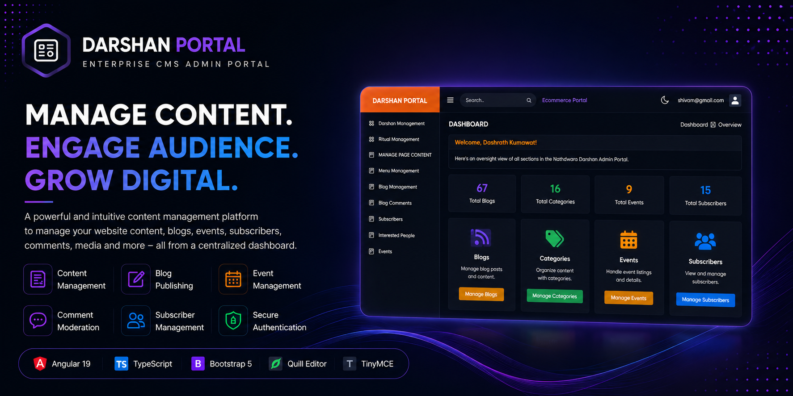
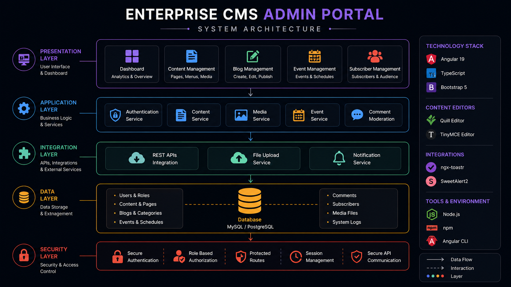
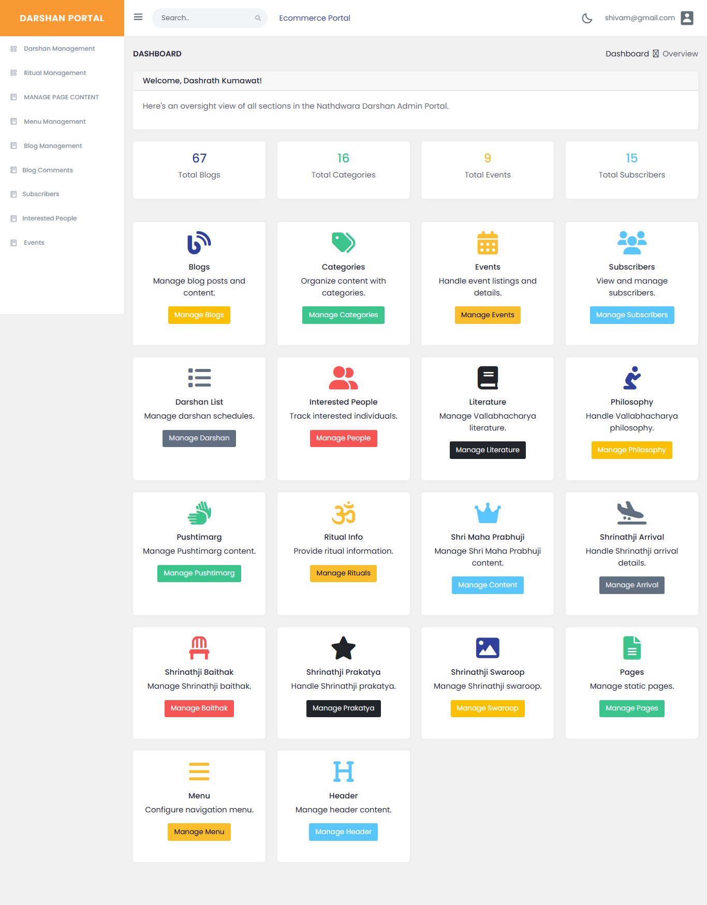
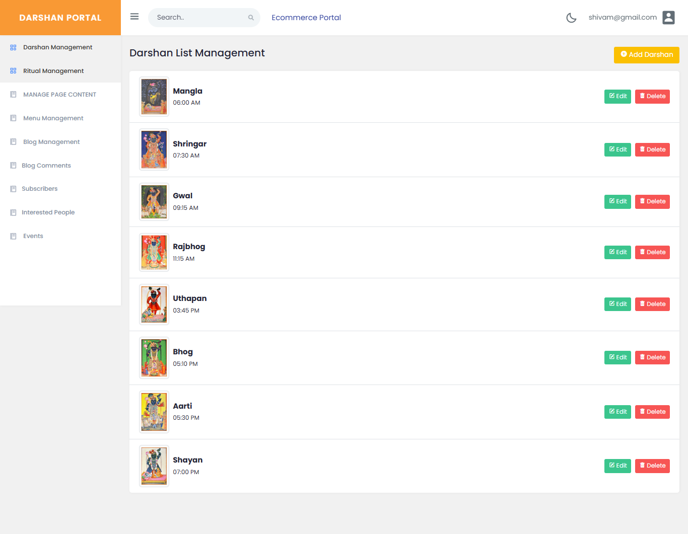
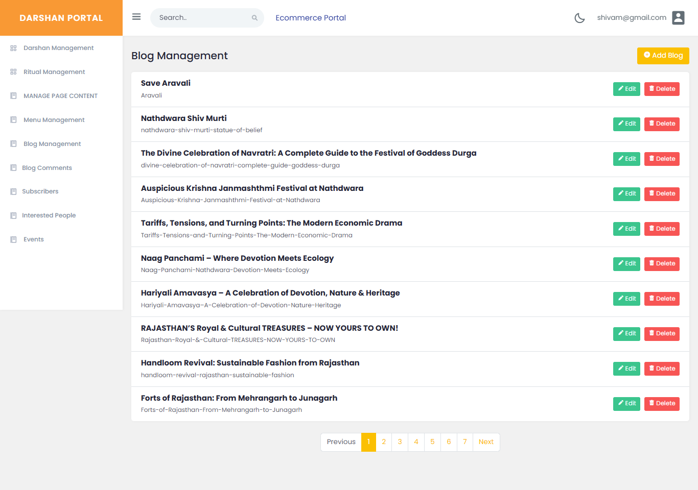
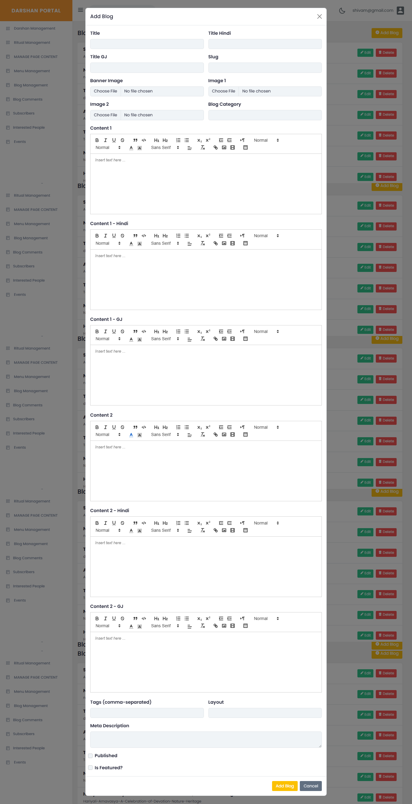
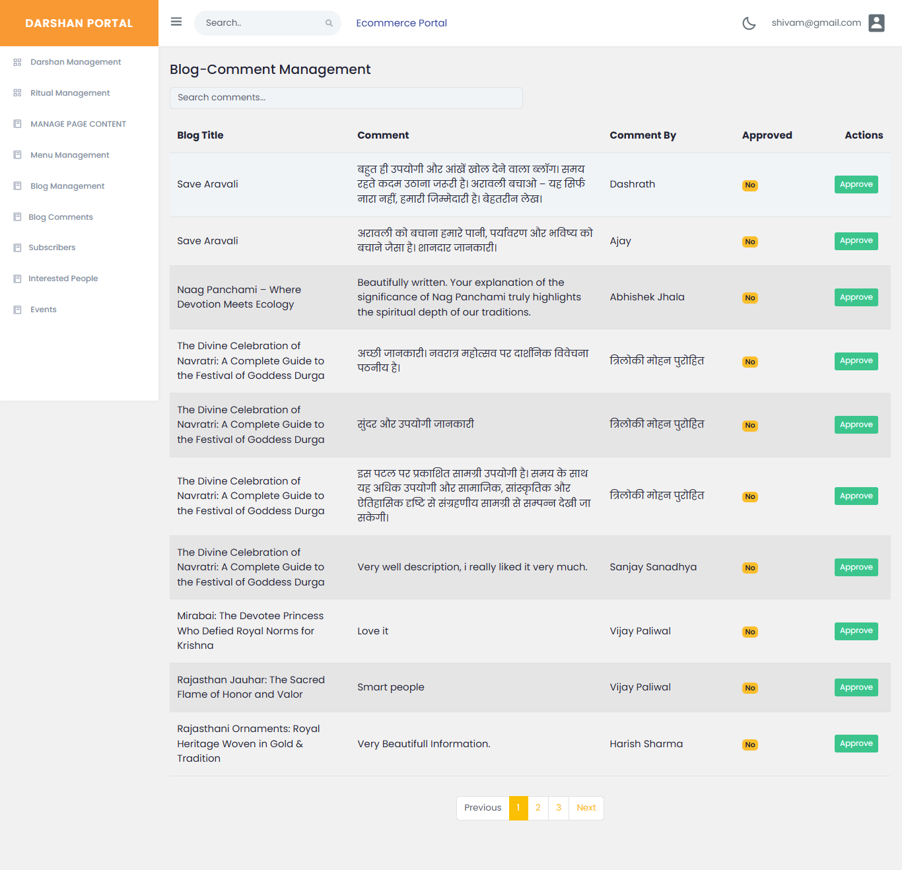
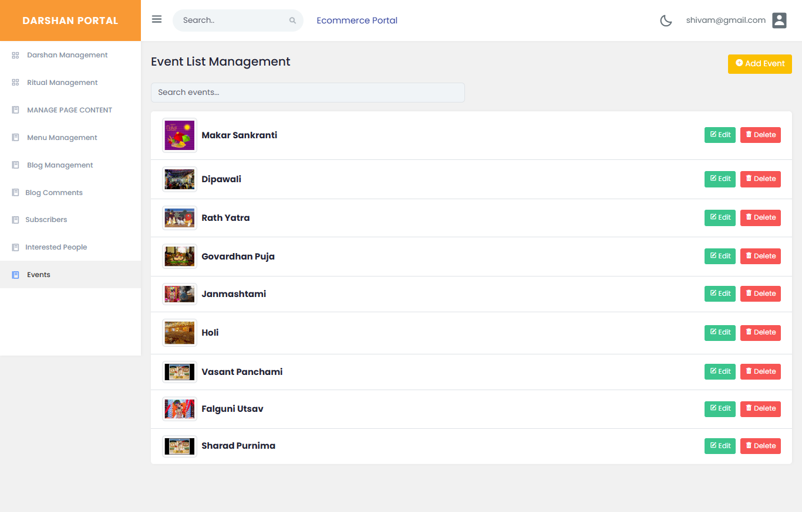

# Enterprise CMS Admin Portal


Modern Angular 19-based enterprise content management portal designed to manage website content, blogs, events, subscribers, media assets, and multilingual information through a centralized administrative interface.

---

<p align="center">
  
</p>

---

## Overview

Enterprise CMS Admin Portal is a modern administration platform built to simplify content publishing, website management, event administration, subscriber management, and editorial workflows through a secure and user-friendly interface.

The platform enables administrators to efficiently manage digital content while maintaining a scalable and organized content ecosystem.

---

## Platform Vision

Enterprise CMS Admin Portal is designed to simplify content administration, publishing workflows, event management, subscriber engagement, and website operations through a centralized administrative experience.

The platform empowers administrators to manage multilingual content, digital assets, blogs, events, comments, and website information efficiently while maintaining scalability, security, and operational consistency.

---

## Platform Highlights

* Enterprise Content Management
* Blog Publishing Workflows
* Event Management System
* Comment Moderation Tools
* Subscriber Management
* Media Asset Management
* Multilingual Content Support
* Rich Text Editing Experience
* Secure Authentication
* Responsive Administrative Interface
* Scalable Architecture
* Centralized Dashboard Experience

---

## Business Problem

Organizations often struggle with fragmented content management processes, inconsistent publishing workflows, disconnected communication channels, and inefficient administrative operations.

Managing website content, events, blogs, subscribers, and digital assets across multiple systems can increase complexity and reduce operational efficiency.

---

## Solution

Enterprise CMS Admin Portal centralizes content publishing, event administration, subscriber management, moderation workflows, and website operations into a unified platform.

The solution improves administrative efficiency, streamlines content workflows, enhances collaboration, and simplifies digital platform management.

---

## Features

### Content Management

* Static Page Management
* Dynamic Content Publishing
* Menu Configuration
* Website Content Administration
* Media Asset Management

### Blog Management

* Create, Edit & Delete Blogs
* Rich Text Editing
* SEO Metadata Management
* Slug Generation
* Banner & Media Uploads
* Multilingual Blog Content

### Comment Moderation

* Blog Comment Approval
* Comment Review Workflows
* User Interaction Management
* Content Moderation Tools

### Event Management

* Event Publishing
* Event Updates
* Event Listing Management
* Schedule Management

### Subscriber Management

* Subscriber Administration
* Audience Management
* Interested User Tracking
* Communication Readiness

### Dashboard Analytics

* Content Statistics
* Blog Metrics
* Event Statistics
* Subscriber Overview
* Centralized Administrative Dashboard

### Specialized Modules

* Darshan Management
* Ritual Management
* Event Administration
* Blog Publishing
* Comment Moderation
* Subscriber Management
* Menu Management
* Static Page Management
* Multilingual Content Management
* Media Asset Management

### Security & Administration

* Secure Authentication
* Protected Administrative Access
* Route-Based Authorization
* Session Management
* Secure API Integration

---

## Technology Stack

### Frontend

* Angular 19
* TypeScript
* Standalone Components
* Angular Router
* RxJS

### UI & Experience

* Bootstrap 5
* Responsive Design
* Dashboard Components
* Modern Administrative Interface

### Content Editing

* Quill Editor
* TinyMCE Editor
* Rich Text Content Management

### Notifications & UX

* ngx-toastr
* SweetAlert2

### Development Tools

* Angular CLI
* Node.js
* npm

---

## System Architecture

<p align="center">
  
</p>

---

### Presentation Layer

* Dashboard
* Content Management
* Blog Management
* Event Management
* Subscriber Management

### Application Layer

* Authentication
* Content Services
* Media Services
* Event Services
* Comment Moderation

### Integration Layer

* REST APIs
* File Upload Services
* Notification Services

### Security Layer

* Authentication
* Authorization
* Protected Routes
* Secure API Communication

---

## Platform Modules

### Dashboard

Centralized overview of content metrics, events, blogs, subscribers, and operational insights.

<p align="center">
  
</p>

---

### Darshan Management

Manage darshan schedules, timings, listings, and related content through a centralized administration interface.

<p align="center">
  
</p>

---

### Blog Management

Create, update, organize, and publish blog content with integrated content management tools.

<p align="center">
  
</p>

---

### Rich Text Blog Editor

Advanced content editing experience with support for media uploads, formatting tools, metadata management, and publishing controls.

<p align="center">
  
</p>

---

### Comment Moderation

Review, approve, and manage community interactions through built-in moderation workflows.

<p align="center">
  
</p>

---

### Event Management

Manage events, schedules, listings, and publishing workflows from a centralized dashboard.

<p align="center">
  
</p>

---

## Platform Capabilities

* Enterprise Content Management
* Dashboard Administration
* Rich Text Publishing
* Multilingual Content Support
* Event Administration
* Comment Moderation
* Subscriber Management
* Media Management
* Responsive Interface
* Secure Authentication
* Modular Architecture
* Scalable Design

---

## Performance & Scalability

### Performance Highlights

* Angular 19 Standalone Architecture
* Optimized Component Rendering
* Responsive Dashboard Design
* Modular Application Structure
* Efficient API Integration
* Production-Ready Build Configuration

### Scalability Features

* Component-Based Architecture
* Modular Feature Organization
* Expandable Administrative Modules
* Scalable Content Management Workflows
* Environment-Based Configuration
* Enterprise Deployment Readiness

---

## Platform Focus Areas

* Content Management Systems
* Digital Publishing
* Event Management
* Subscriber Engagement
* Administrative Workflows
* Website Administration
* Dashboard Applications
* Enterprise Web Platforms
* Multilingual Content Delivery
* Content Moderation Systems

---

## Product Roadmap

### Phase 1 — Core CMS

* Content Management
* Blog Publishing
* Event Administration
* Subscriber Management

### Phase 2 — Workflow Enhancements

* Advanced Moderation Tools
* Analytics Dashboard
* Enhanced Search
* Media Management Improvements

### Phase 3 — Enterprise Expansion

* Role-Based Permissions
* Audit Logs
* Advanced Reporting
* Workflow Automation

### Phase 4 — Future Innovation

* AI-Assisted Content Management
* Smart Publishing Recommendations
* Advanced Analytics
* Enhanced Personalization

---

## Repository Structure

```text
assets/
├── architecture/
│   └── enterprise-cms-adminportal-system-architecture.png
├── banner/
│   └── enterprise-cms-adminportal-banner.png
└── screenshots/
    ├── Dashboad.png
    ├── Darshan-List.png
    ├── Blogs.png
    ├── Add_blog_form.png
    ├── Blog_Comment.png
    └── Event_list.png
```

---

## Source Code Availability

The source code for this project is not publicly available.

This repository is intended to showcase the platform architecture, administrative workflows, user experience, features, and technology stack.

---

## Engineering Vision

The platform is engineered to provide a scalable, maintainable, and secure administrative experience while simplifying digital content operations.

The architecture focuses on modular development, operational efficiency, user experience, and long-term scalability for enterprise content management requirements.

---

## Why This Platform Exists

Modern organizations require efficient tools for managing content, communication, events, subscribers, and digital experiences.

Enterprise CMS Admin Portal was developed to centralize these operations into a single platform, improving productivity, consistency, and administrative efficiency.

---

## Engineering Highlights

* Angular 19 Standalone Architecture
* Component-Based Design
* Modular Content Management System
* Responsive Dashboard Interface
* Enterprise Administration Workflows
* Scalable Frontend Architecture
* Production-Ready Application Structure

---

## License

All Rights Reserved

Copyright © 2026 SHIVAM ITCS
